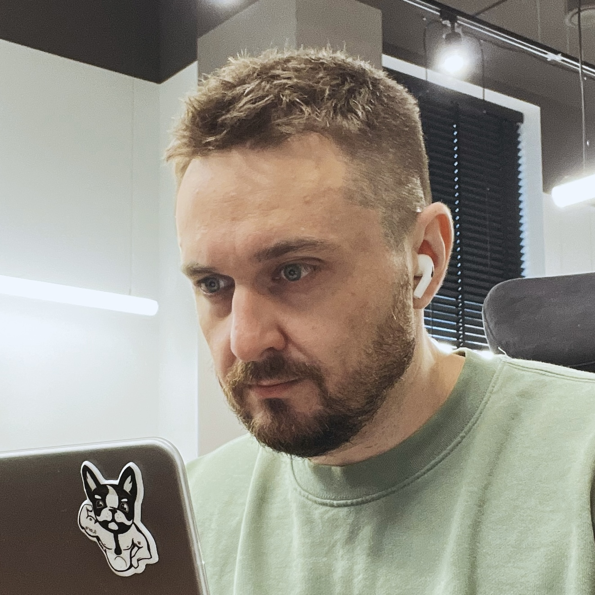

  

    
  

  

    
DMYTRO SOLOHUB

    
Full-stack software engineer

    
CTO in @Syncspert

    

        
8+ as a software engineer

        
5+ as a team lead

    

    

        
        
    

  

I've been working in IT industry as a software engineer since 2017.
As a technical leader, I've successfully managed development teams and infrastructure, leading to successful project completions and satisfied clients.
My expertise spans both backend and frontend development, with a strong focus on time and within scope.
